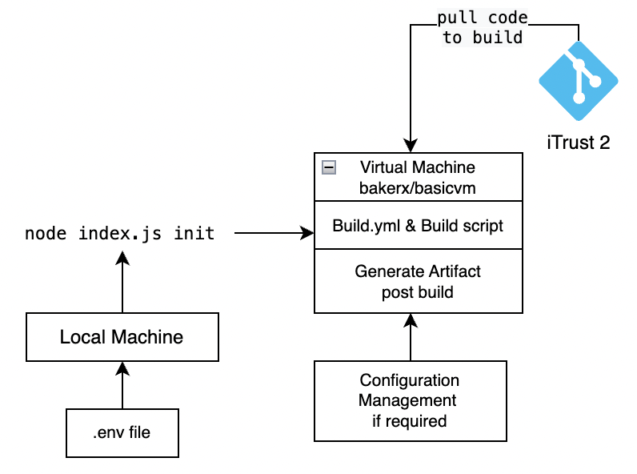

# Pipeline-Template

## M1 - Milestone 1

### Objective 📝:

- To provision a computing environmnet(VM) and run tasks inside that computing environment from a host machine.
- Create Two commands:
    - `pipeline init` - Provision and configure computing environment for pipeline
    - `pipeline build [job-name] [build.yml]` - Trigger a build job, running steps outlined by build.yml, wait for output, and print build log

- To make the program agnostic to the host environment(OS) and do any platform-specific work inside a locally provisioned virtual machine.
- Tasks To Perform
    - Automatically provision and configure a build server(VM)
    - Create a build job specification.
    - Automatically configure a build environment for given build job specification

---------
### Flow Chart 📊



-----
### Pre-Requisites

- Bakerx for Linux and Windows OS
   - If not already on system, git clone from [here](https://github.com/ottomatica/bakerx.git)
   
     - `Clone the repo` >> `cd bakerx` >> `npm install` >> `npm link`

- Basicvm for Mac M1
  - If not already on system,
      - brew uninstall ottomatica/ottomatica/basicvm
      - brew install ottomatica/ottomatica/basicvm
      - vm pull ubuntu:focal
      
- Nodejs
--------   
### Instructions to Run 💻:

- The project runs on all Operating systems if the prerequisites - node and bakerx(Windows/Ubuntu)/basicvm(Mac OS) are preinstalled in the system.
- Create a build.yml file in the root directory of the project
      - Refer to the [template](https://github.ncsu.edu/CSC-DevOps-S22/DEVOPS-27/blob/main/build.yml.template)
     
 

- Create a .env file in the root directory of the project.
   - It should contain the github access token in format - `ACCESS_TOKEN="xxxxxxxxx"`
- npm install
- npm link
---------------
### Methods :
- The initial step was creating the VM(build environment) and configuring it with host only networking and shared folder. The VM initialization was customised based on the OS and the relative paths for shared folders were taken into consideration
- Installation of requirements/dependencies of iTrust and Testing it on local system
- setting up access token in the environment variable of VM upon creation of VM - ssh test info command concatenated with environment variable setting command
 `ssh -i "/path/of/directory/.bakerx/insecure_private_key" vagrant@127.0.0.1 -p 2004 leared-o StrictHostKeyChecking=no -o UserKnownHostsFile=/dev/null "sudo cat /bakerx/pipeline.env | sudo tee -a /etc/environment"` and using the custom ip of basicVM read from a temporary file.
- Doing initial cleanup and necessary setup on the VM based on the OS and the frequently occurring errors.
- The commands were executed using child processes.
- The artifacts are generated in the workspace folder in the root directory of the VM. Once the build is successful, the workspace and database is cleared for the next build.
-------------------
### Features:

- Virtual Machine is configured Host environment agnostic
- Virtual Machine is configured with Host-only-Networking
- Virtual Machine is configured with shared folder functionality
- Build.yml to install requirements for iTrust java project
- Implements two build jobs with different build commands
-----------------
### Issues:
- Figuring out usage of bakerx.Initially, trying to load the bakerx module into the init command and fixing errors while running it.
- Realized to consider bakerx as a pre-req and directly use the bakerx run command inside `init` command
- what will go in pipeline.env file? Figured out that iTrust need useraname and password for cloning, therefore to remove the complexity of username and password, used ACCESS_TOKEN to clone iTrust. The ACCESS_TOKEN is a input for pipeline.env file
- parsing the build.yml to ssh the commands written in build.yml
- Tried using script to run the commands inside VM.Parsed the build.yml, created a script, writing the commands in the script and running it, but it was an overkill so did not used it in the final code
- Faced issue while trying to parse nad run commands from the Build.yml when we had to use multiple commands in a go. Had to use delimiters effectively.
- Faced issue when building iTrust if using the default memory allocated to the VM in windows and ubuntu. Had to increase the memory to 4GB.

- Basicvm error while running apt installs

    - Release files not found  ```E: Release file for http://ports.ubuntu.com/ubuntu-ports/dists/focal-updates/InRelease is not valid yet (invalid for another 57d 1h 50min 51s). Updates for this repository will not be applied. ```. The fix was done using setting up time on the vm - ```sudo timedatectl set-ntp off && sudo timedatectl set-ntp on ``` 

    - Flash Kernel issue - ```dpkg: error processing package flash-kernel (—configure)```. It was fixed using: ```sudo dpkg --configure -a``` and ```sudo apt remove flash-kernel -y```. These steps were included in arm-cleanup.yml.


    - Unable to lock the administration directory (/var/lib/dpkg/). This issue occurs and gets fixed once the lock is automatically released after few retries.
    
- SQL errors while setting up grants for root: the user root@localhost was not given access to the server and changing the application.yml from the build script would have been a bad idea. So we bypassed it using a blank password.
    ```sudo mysql -e \"ALTER USER 'root'@'localhost' IDENTIFIED WITH mysql_native_password BY ''\"```

-----
### Screencast:

<a href= "https://drive.google.com/file/d/184o746bm0G0iN78rcMcR8CQ6zc1BkDQ4/view">Linux</a>

<a href= "https://drive.google.com/file/d/1Z6H_ZYDIlphirL4mhkmk9feQUCpj7KAT/view?usp=sharing">Mac M1</a>

<a href="https://drive.google.com/file/d/1V6J6HQFfjbpO--E7Ox3wLr4_UcNt9tf8/view?usp=sharing">Windows</a>

------------
