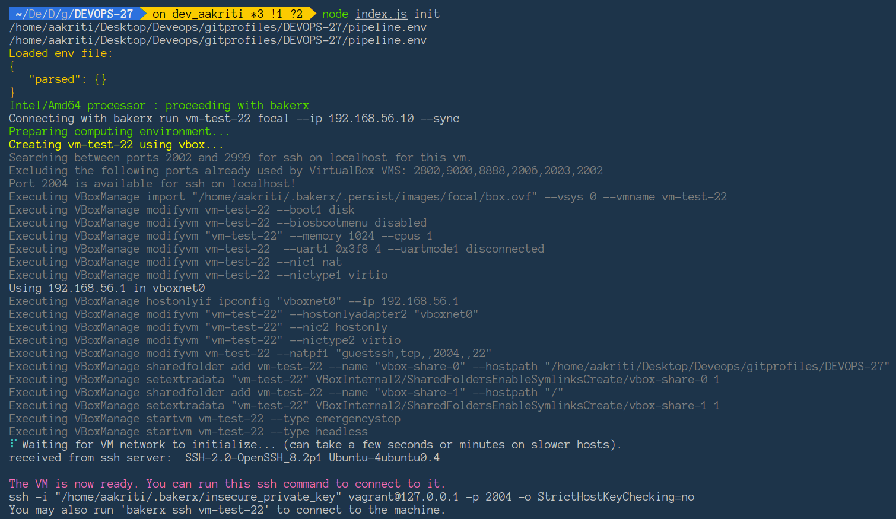
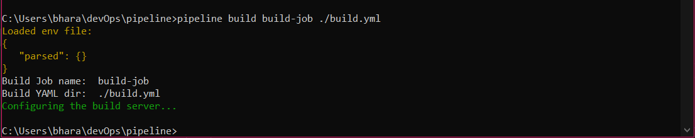
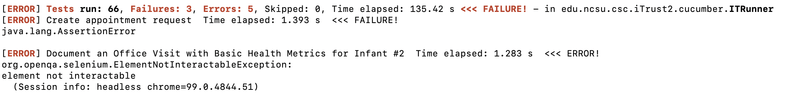

March 2nd,2022

# Checkpoint - M1

## Done:

1. Understanding basic flow:


2. Init command
- VM provisioning (OS agnostic)- ``` node index.js init ``` provisions the VM with following features.
   - Features:
      - Reads the processor and detect the architecture to use ``` basicvm ``` for M1 and ```bakerx``` for Linux and windows
      - Shared folder - ```--sync``` is used for mounting the current directory on host which is accessible via ```bakerx```
      - Host-only-Networking - the NIC is assigned a static ip, basic vm implements host only network
      - ssh access - The provisioned VM gives the ssh access into the VM and the command is displayed on terminal to ssh once provisioning is done

***BasicVM:***


---------------------------------------------------------------------------------------------------------------------


---------------------------------------------------------------------------------------------------------------------

***BakerxVM***


----------------------------------------------------------------------------------------------------------------------


3. Build Command
   - Created the build command which accepts two command line arguments,the build job name and the build.yml.
   


4. JS-YAML parser for build.yml
    - javascript parser for yaml files is added to the build command

5. itrust local build

   - iTrust2-0.0.1-SNAPSHOT.jar was generated in the iTrust2/target directory. 
  
   

----------------------------------------------------------------------------------------------------------------------


## In Progress:

Creating build.yml and updating the build script to clone and build the itrust maven project

## To be done:

1. Testing the maven project without itrust

2. Parsing the build.yml

3. Executing commands inside the VM
 

## Issues Faced:

1. Using the bakerx library into node init:
   - tried using bakerx run and pull command from init.js of our project
   - worked around on few of the errors from using bakerx run like provider not found, bakerx.yml not found.
   - Fixed them on the go but still not clear with using bakerx run command under init command
   - Figured out to use ``` sshCmd ``` to use BAKERX and BASICVM(assuming bakerx and basicvm is already there on users machine)

2. Basicvm was not working when initiated from init.js - The problem seemed to be in the name of the binary and changing that to ‘vm’ worked.

3. Building iTrust with tests

   - The iTrust project required an SQL server successfully build with test cases, so we set up an SQL server on local. 
   - Some cucumber tests are failing due to non interactable elements, fix in progress.

      
   

## Questions to be answered:

1. Why am I able to access the host directories form VM - basicvm?
2. What do we need to write in pipeline.env and why? ssh keys not found on local?
3. Why do we need the ip address of the build server stored?
4. Do we need to fix the cucumber tests as the artifact still gets generated?
5. Do we need configuration management?
6. How to used Node.js to execute commands on the vm which require subsequent input, such as providing username, password for git clone or MySQL DB creation.
7. Can we list the commands we want to execute in the VM in the Build.yml steps or should it be human understandable and we have to parse the strings and execute corresponding commands?


